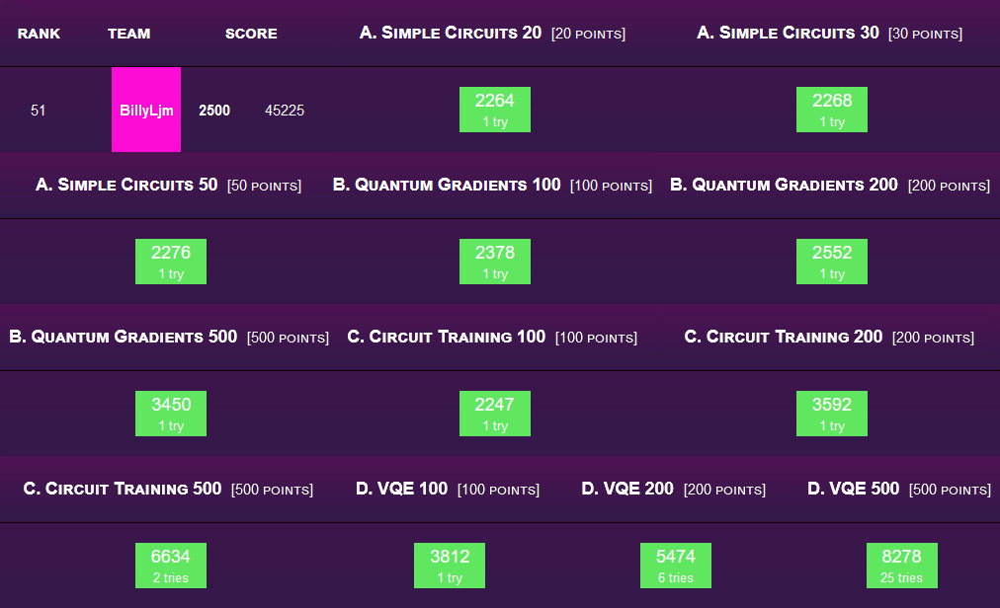

  
  
## Introduction  
Hi, these are my solutions to the [QHack 2021](https://qhack.ai) quantum machine learning hackathon.  
Everything is coded in Xanadu's [PennyLane](https://pennylane.readthedocs.io) quantum programming package.  
The original repo with all the hackathon details can be found at [/XanaduAI/QHack](https://github.com/XanaduAI/QHack2021).  
  
## Hackathon Details  
__Site:__ [QHack.ai](https://qhack.ai)  
__Date:__ February 2021  
  
## Score  
Here is a screenshot of my completed hackathon scoreboard entry.  
I ranked 51<sup>st</sup> in terms of cumulative completion time for the problem sets.  
  
  
## Files  
The `QML_Challenges` folder contains all the problem statements and solutions.  
Each problem set is in its own sub-folder with the name `<topic>_<score>_template`.  
In each problem set, there is a `.pdf` problem statement and a `.py` solution.  
There are also given test input `.in` and answers `.ans` with can be invoked in terminal via  
```console  
>> python <problem name>_template.py < 1.in  
```  
  
## Topics  
[`simple_circuits_20`](QML_Challenges/simple_circuits_20_template) - 1-qubit Circuits  
[`simple_circuits_30`](QML_Challenges/simple_circuits_30_template) - 1-qubit Circuits  
[`simple_circuits_50`](QML_Challenges/simple_circuits_50_template) - 2-qubit Circuits  
[`quantum_gradients_100`](QML_Challenges/quantum_gradients_100_template) - Parameter-shift Rule  
[`quantum_gradients_200`](QML_Challenges/quantum_gradients_200_template) - Hessian Matrix  
[`quantum_gradients_500`](QML_Challenges/quantum_gradients_500_template) - Natural Gradient  
[`circuit_training_100`](QML_Challenges/circuit_training_100_template) - PennyLane's Optimisers  
[`circuit_training_200`](QML_Challenges/circuit_training_200_template) - Maximal Independent Set  
[`circuit_training_500`](QML_Challenges/circuit_training_500_template) - Variational Classifier  
[`vqe_100`](QML_Challenges/vqe_100_template) - Variational Quantum Eigensolver (VQE)  
[`vqe_200`](QML_Challenges/vqe_200_template) - Ansatz Design  
[`vqe_500`](QML_Challenges/vqe_500_template) - VQE for Excited States  